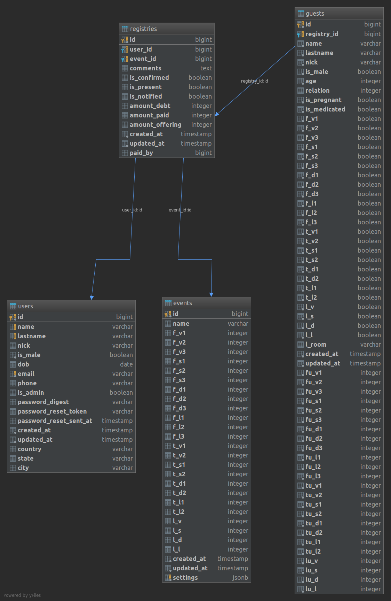

## DataBase Diagram


## Queries
There are a list of common used [queries](queries.md).

### Run DB Commands

#### Configure JetBrains DataGrip
##### Heroku
```bash
heroku pg:credentials:url
```
Copy the results, and in advanced tab set the following:
* `ssl` => `true`
* `sslfactory` => `org.postgresql.ssl.NonValidatingFactory`


Reset heroku db
```bash
heroku pg:reset --confirm <app_name>
```

Interactive console
```bash
docker run -it --rm -e PGPASSWORD=123 \
           --link regdb:postgres postgres:10.4 \
           psql -h regdb -U reg -d reg
```
Make queries from Command line
```bash
docker run -it --rm -e PGPASSWORD=123 \
           --link regdb:postgres postgres:10.4 \
           psql -h regdb -U reg -d reg -c 'SELECT * FROM users'
```

### Create DB Backups
#### Heroku
```bash
day=$(date +%y%m%d-%H%M)
appname=<APPNAME>
dump_file="$day-db.dump"

heroku pg:backups capture --app $appname
url=$(heroku pg:backups public-url --app $appname)
curl -o "$dump_file" "$url"
```
#### Local
```bash
user=reg
pwd=123
db=reg
docker run -it --rm -v $PWD:/tmp/data -e PGPASSWORD="$pwd" \
           --link regdb:postgres postgres:10.4 \
           pg_dump -h regdb -U "$user" -d "$db" \
           -Fc --no-acl --no-owner -f "/tmp/data/db.dump"
```
### Restore DB Backups
#### Heroku
```bash
heroku pg:backups
heroku pg:backups:restore b101 --confirm
```
#### Local
```bash
user=reg
pwd=123
db=reg
docker run -it --rm -v $PWD:/tmp/data:ro -e PGPASSWORD="$pwd" \
           --link regdb:postgres postgres:10.4 \
           pg_restore --verbose --clean --no-acl --no-owner --no-password \
           -h regdb -U "$user" -d "$db" /tmp/data/db.dump 
```